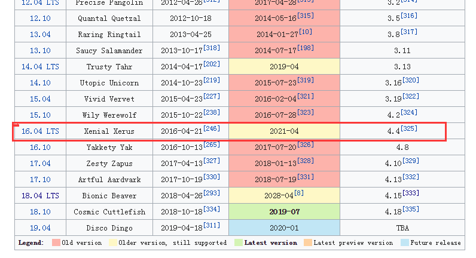
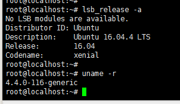
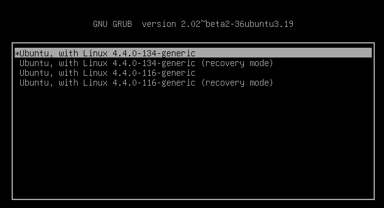
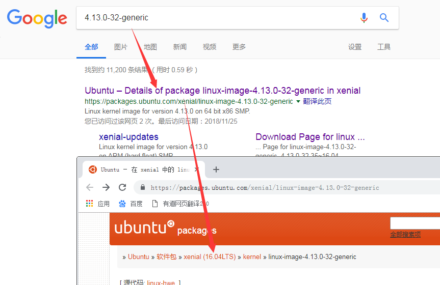

## 如何把Ubuntu升级成指定的内核版本

之前安装yulong的时候，需要根据不同的内核版本来重新编译驱动，但是网上搜索centos或者Ubuntu的下载地址的时候，都是给出发行版本的信息，怎么根据发行版本找到对应的内核版本呢？

以Ubuntu为例，假设要搭建一个内核版本是**4.4.0-134-generic**的环境，首先：

在[**wiki**](https://en.wikipedia.org/wiki/Ubuntu_version_history#Table_of_versions)上查找发型版本和内核版本的对应关系，可以看到4.4内核版本对应的是16.04 LTS


因为有些老版本官网已经没有了，所以到[Old Ubuntu Releases](http://old-releases.ubuntu.com/releases/)下载对应版本并安装


安装好后，查看内核版本发现是 **4.4.0-116-generic**


这和需要的 **4.4.0-134-generic** 版本还不一样，接着开始升级指定内核，先用命令安装相关软件包：

```bash
apt-get install -y linux-image-4.4.0-134-generi
```


接着重启，在bios页面过去后，按esc就可以选择指定内核启动了（tips：在输入`apt-get install -y linux-image-4`后，可以重复按tab键，确认是否有想要安装的内核版本）


最后安装一些头文件，编译驱动的时候会用到

```bash
apt-get install linux-headers-$(uname -r)
```

总结：~~安装指定内核版本，需要先安装内核主次版本号对应的发行版本，接着在使用apt-get升级成指定内核版本，但是apt-get不能跨**主版本**升级，例如：安装4.4.0-134-generic，你下了一个内核是4.2的系统镜像安装，是不能从4.2升级到4.4的。~~ 之前说的有些错误，应该是在谷歌上搜索指定内核的关键字，然后通过搜索出来的内容查看内核属于哪个发行版本，再下载对应的发行版本通过apt安装
