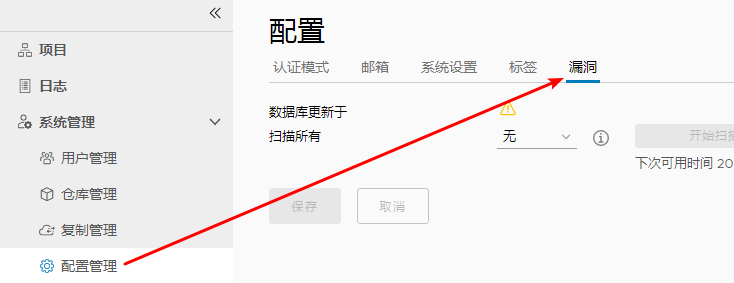
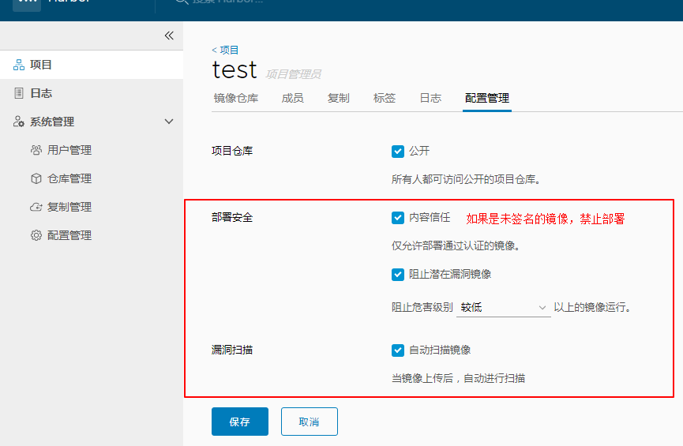
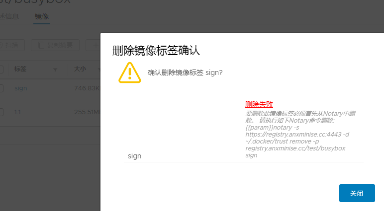
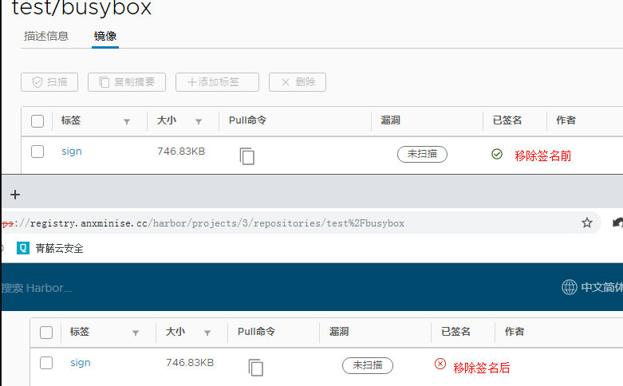
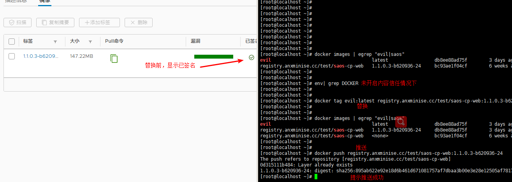
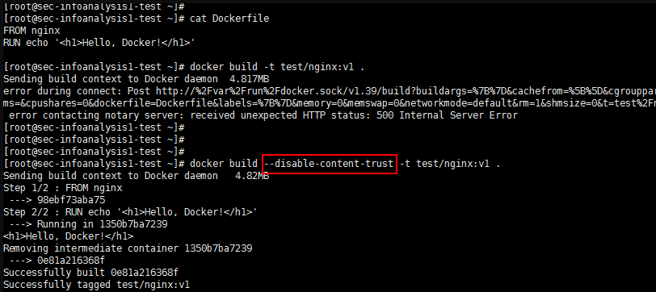

## 1. 如何使用harbor的notary功能进行安全加固

### 1.1. notary介绍：

在构建镜像时，通常会基于一些基础镜像，添加符合应用场景的镜像层，得到新的镜像。为了防止在构建过程中，非法植入恶意镜像层，便有了内容信任（Content Trust）机制，用以保证镜像层来源可信。

Notary 是一套镜像的签名工具， 用来保证镜像层在 pull、push、transfer 过程中的一致性和完整性。避免中间人攻击，阻止非法的镜像更新和运行。

镜像层的创建者可以对镜像层做数字签名，生成摘要，保存在 Notary 服务中。开启 Content Trust 机制之后，未签名的镜像无法被拉取。

### 1.2. 未开启内容信任功能

在未开启内容信任的情况下，先模拟黑客攻击是否能攻击成功。

#### 1.2.1. 攻击背景

攻击前提：黑客获取到harbor的登陆密码
攻击思路：黑客制作了一个恶意镜像，并把此镜像替换到harbor仓库里的正常镜像，当其他地方拉取并运行此镜像的时候，攻击成功。

| 镜像名                                  | 镜像大小 | 属性       |
| :------------------------------------- | :------- | :--------- |
| evil                                   | 1.224 MB | 恶意镜像	 |
| registry.anxminise.cc/test/saos-cp-web | 277.1 MB | 正常镜像    |


#### 1.2.2. 攻击步骤

##### 1.2.2.1. 使用tag命令把恶意镜像替换成正常镜像


##### 1.2.2.2. 使用push命令推送镜像，成功把恶意镜像替换了正常镜像


##### 1.2.2.3. docker拉取并运行镜像


#### 1.2.3. 结论

在未开启内容信任的时候，这类攻击手法是可以成功的，体现在两个方面：

- 镜像被替换后，docker客户端拉取镜像成功
- 镜像被替换后，harbor上并没有显示出镜像被替换

### 1.3. 开启内容信任

#### 1.3.1. 步骤

##### 1.3.1.1. 开启harbor镜像扫描与签名镜像功能

```bash
[root@localhost harbor]# docker-compose down -v
[root@localhost harbor]# ./prepare --with-notary --with-clair
[root@localhost harbor]# docker-compose -f ./docker-compose.yml -f docker-compose.notary.yml -f ./docker-compose.clair.yml up -d
```

开启成功后，harbor会比没开的多出如下东西：





#### 1.3.2. push镜像

##### 1.3.2.1. docker客户端开启签名

开启harbor内容信任后，如果客户端要push镜像则需要配置环境变量，否则虽然push成功，但是会在harbor上标识未签名。下图显示push成功，但是harbor上未通过：


##### 1.3.2.2. docker客户端开启签名

默认docker客户端的签名功能是关闭的，要启用它，需设置如下环境变量：

```bash
[root@localhost ~]#
[root@localhost ~]# export DOCKER_CONTENT_TRUST=1
[root@localhost ~]# export DOCKER_CONTENT_TRUST_SERVER=https://registry.anxminise.cc:4443
[root@localhost ~]#
```

如未登陆仓库，则需登陆harbor仓库（已登陆跳过此步）

```bash
[root@localhost ~]# docker login registry.anxminise.cc
Username: admin
Password:
Error response from daemon: Get https://registry.anxminise.cc/v1/users/: x509: certificate signed by unknown authority                    
[root@localhost ~]# vim /etc/docker/daemon.json
[root@localhost ~]#
[root@localhost ~]#
[root@localhost ~]# cat /etc/docker/daemon.json
{
"insecure-registries": ["registry.anxminise.cc"]
}
[root@localhost ~]#
[root@localhost ~]#
[root@localhost ~]# systemctl restart docker
[root@localhost ~]#
[root@localhost ~]#
[root@localhost ~]# docker login registry.anxminise.cc
Username: admin
Password:
Login Succeeded
```

push命令上传镜像


**注1：如报错【x509: certificate signed by unknown authority】，可能是docker版本过低，请升级**

**注2： 根密钥生成于: /root/.docker/trust/private/，镜像密钥生成于: /root/.docker/trust/tuf/[registry name]/[imagepath]**

**注3：要使用notary，必须在Harbor中启用HTTPS。**

#### 1.3.3. 删除镜像

对于签名过的镜像，不能直接删除，需要先移除签名才可以删除，如下图：



使用notary cli移除镜像签名。需要注意的是如果使用的是自签名证书，则在执行命令的时候添加--tlscacert参数




#### 1.3.4. 拉取镜像

##### 1.3.4.1. 未开启内容信任拉取


##### 1.3.4.2. 开启内容信任后拉取


### 1.4. 攻击复测

开启内容信任后，再次模拟攻击看是否成功。攻击背景及思路同上不变。
攻击前提：黑客获取到harbor的登陆密码
攻击思路：黑客制作了一个恶意镜像，并把此镜像替换到harbor仓库里的正常镜像，当其他地方拉取并运行此镜像的时候，攻击成功。

| 镜像名                                  | 镜像大小 | 属性               |
| :------------------------------------- | :------- | :----------------- |
| evil                                   | 1.224 MB | 恶意镜像，未签名	 |
| registry.anxminise.cc/test/saos-cp-web | 277.1 MB | 正常镜像，已签名     |

#### 1.4.1. 攻击步骤

使用tag命令把恶意镜像替换成正常镜像


使用push命令推送镜像。注意替换前，镜像显示的是已签名，在未开启内容信任情况下把恶意镜像替换了正常镜像



刷新页面，发现已经提示未签名，尝试在docker客户端拉取并运行镜像发现失败


如果在开启内容信任的情况下，推送镜像提示失败


### 1.5. 结论

在开启内容信任后，就算入侵者获得harbor登陆密码也能杜绝这类攻击手法，体现在几个方面：

- 镜像被替换后，docker客户端拉取镜像失败
- 镜像被替换后，harbor上显示出镜像被替换
- 推送镜像的时候需要镜像密码

#### 1.5.1. 开启内容信任后，影响的命令有：

- push
- build
- create
- pull
- run

举例如果build的时候，引用的镜像是未签名的，会build失败，如下图：


如需build未签名的镜像，需加参数--disable-content-trust：

