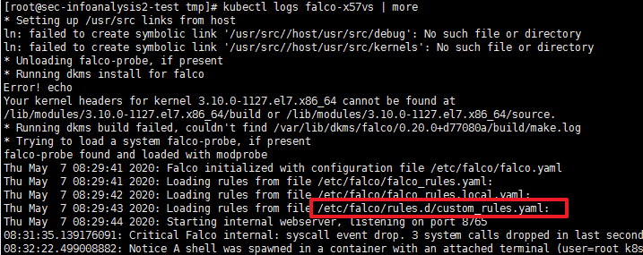

## 1. 如何使用helm部署falco

### 1.1. 部署

使用helm部署falco，推荐把日志格式化成json，这样日志信息会比较详细  

```
# helm install stable/falco --name falco -f custom_rules.yaml  --set ebpf.enabled=true,falco.jsonOutput=true,image.tag=0.23.0 
```  

从集群删除  

```
# helm delete --purge falco
```  

出现CrashLoopBackOff可能是内核不匹配  

  

检查日志进一步确认是不是内核问题  

  

升级目标节点内核后重启，问题解决  

```
yum install kernel
yum -y install kernel-devel-$(uname -r)
```  

  

### 1.2. 使用自定义规则  

```
# cat custom_rules.yaml 
customRules:
  custom_rules.yaml: |- 
    - rule: Unauthorized process
      desc: There is a running process not described in the base template
      condition: spawned_process and container and proc.args contains "serviceaccount"
      output: Unauthorized process (%proc.cmdline) running in (%container.id)
      priority: ERROR
      tags: [process]
    - list: safe_etc_dirs
      items: [/etc/titanagent]
# helm upgrade falco -f custom_rules.yaml stable/falco

```  

查看日志可以看到自定义规则被加载  

  

### 1.3. 如何去除误报

分析日志发现有如下误报，下面谈谈如何修改规则去除误报  

```
20:46:45.519621929: Warning Sensitive file opened for reading by non-trusted program (user=<NA> program=titanagent command=titanagent -d file=/etc/shadow parent=<NA> gparent=<NA> ggparent=<NA> gggparent=<NA> container_id=host image=<NA>) k8s.ns=<NA> k8s.pod=<NA> container=host k8s.ns=<NA> k8s.pod=<NA> container=host k8s.ns=<NA> k8s.pod=<NA> container=host
```

#### 1.3.1. 定位规则  

首先从误报信息里提取关键字，如：non-trusted，然后到falco的规则文件falco_rules.yaml里查找，看下这条规则是如何编写的，找到如下：  

```yaml
- rule: Read sensitive file untrusted
  desc: >
    an attempt to read any sensitive file (e.g. files containing user/password/authentication
    information). Exceptions are made for known trusted programs.
  condition: >
    sensitive_files and open_read
    and proc_name_exists
    and not proc.name in (user_mgmt_binaries, userexec_binaries, package_mgmt_binaries,
     cron_binaries, read_sensitive_file_binaries, shell_binaries, hids_binaries,
     vpn_binaries, mail_config_binaries, nomachine_binaries, sshkit_script_binaries,
     in.proftpd, mandb, salt-minion, postgres_mgmt_binaries)
    and not cmp_cp_by_passwd
    and not ansible_running_python
    and not proc.cmdline contains /usr/bin/mandb
    and not run_by_qualys
    and not run_by_chef
    and not run_by_google_accounts_daemon
    and not user_read_sensitive_file_conditions
    and not perl_running_plesk
    and not perl_running_updmap
    and not veritas_driver_script
    and not perl_running_centrifydc
    and not runuser_reading_pam
  output: >
    Sensitive file opened for reading by non-trusted program (user=%user.name program=%proc.name
    command=%proc.cmdline file=%fd.name parent=%proc.pname gparent=%proc.aname[2] ggparent=%proc.aname[3] gggparent=%proc.aname[4] container_id=%container.id image=%container.image.repository)
  priority: WARNING
  tags: [filesystem, mitre_credential_access, mitre_discovery]
```  

#### 1.3.2. 分析规则

找到规则后，分析误报日志里的信息，找出独特的信息作为白名单。如：program=titanagent。接着由于program=%proc.name，所以我们分析规则里proc.name的相关信息：  

```
not proc.name in (user_mgmt_binaries, userexec_binaries, package_mgmt_binaries,
     cron_binaries, read_sensitive_file_binaries, shell_binaries, hids_binaries,
     vpn_binaries, mail_config_binaries, nomachine_binaries, sshkit_script_binaries,
     in.proftpd, mandb, salt-minion, postgres_mgmt_binaries)
```  

这个语句大概的意思就是如果proc.name不属于括号里的内容就告警，所以只要把titanagent加入括号里即可。而括号里的都属于变量，我们找一个合适的变量加进去，如：hids_binaries。在falco_rules.yaml里搜索hids_binaries，找到hids_binaries的定义如下：  

```yaml
- list: hids_binaries
  items: [aide]
```

#### 1.3.3. 添加规则

最后在我们的custom_rules.yaml里加入如下信息：  

```yaml
customRules:
  custom_rules.yaml: |- 
    - rule: Unauthorized process
      desc: There is a running process not described in the base template!!!!!!!!!!!!!!!!!!!!
      condition: spawned_process and container and proc.args contains "serviceaccount"
      output: Unauthorized process (%proc.cmdline) running in (%container.id)
      priority: ERROR
      tags: [process]
    - list: safe_etc_dirs
      append: true
      items: [/etc/titanagent]
    - list: hids_binaries
      append: true
      items: [titanagent]

```  

### 1.4. 参考：    

https://hub.helm.sh/charts/stable/falco/1.0.10
