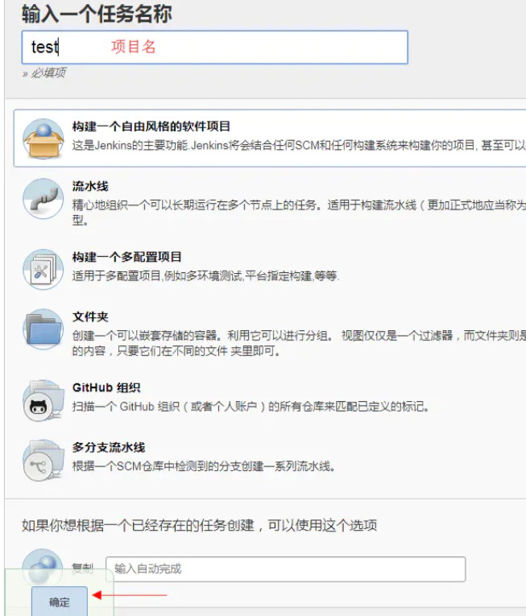
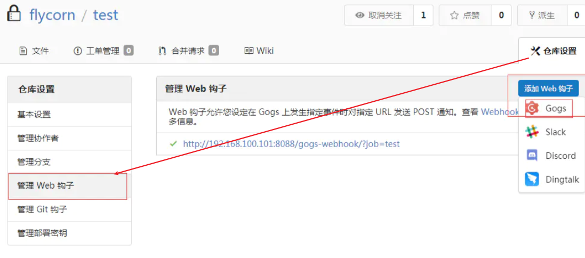
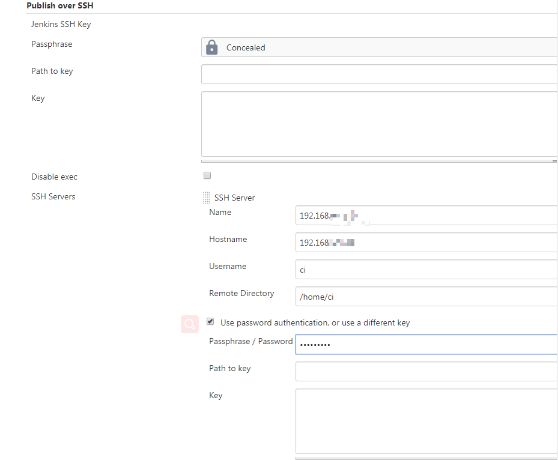

## 1. 如何使用jenkins的Publish over ssh实现远程部署

### 1.1. 新建job  

新建个自由风格的任务，任务名为test  

  

### 1.2. 安装Gogs插件  

打开 系统管理 -> 管理插件 -> 可选插件，在右上角输入框中输入"gogs"来筛选插件  

  

### 1.3. 添加web钩子  

进入仓库，这里使用的是gogs。然后点击【仓库设置】->【管理Web钩子】->【添加Web钩子】-> 【Gogs】  

  

### 1.4. 设置web钩子  

需要注意的是job=test中的test是jenkins里的任务名，需要一一对应，不能填错。    

  

### 1.5. 安装Publish over ssh插件  

  

### 1.6. 设置Publish over ssh  

在远程服务器上添加一个用于更新的用户，如：ci
此用户需要有执行sudo权限，所以在root权限下输入`visudo`，在如下位置添加

```
ci    ALL=(ALL)       ALL
```  

  

【系统管理】【系统配置】中找到【Publish over SSH】，配置远程服务器的ip、登录用户名和密码
Remote Directory输入/home/ci，表示远程工作目录是/home/ci，之后传输的文件都将放于此。  
  
  

### 1.7. 任务设置  

在jenkins任务中的【源码管理】里选择Git，输入仓库url和仓库登陆密码：  

  

接着选择【构建后操作】【send build artifacts over ssh】  

- Source files：需要复制的源文件，**/*表示所有文件以及文件夹
- Remote directory：表示复制到哪个文件夹，这里如果写test，那么会和第二步的【/home/ci】合并起来，表示最后要把文件复制到【/home/ci/test】文件夹里，远程机器没有test文件夹会自动创建
- Exec command：复制完成后，在远程机器上执行的命令，这里加sudo是因为不加会有权限问题。这里写【sudo cp -r test/* /www/threat/】表示把/home/ci/test里的所有文件复制到网站主目录下，这样就实现了远程部署  


